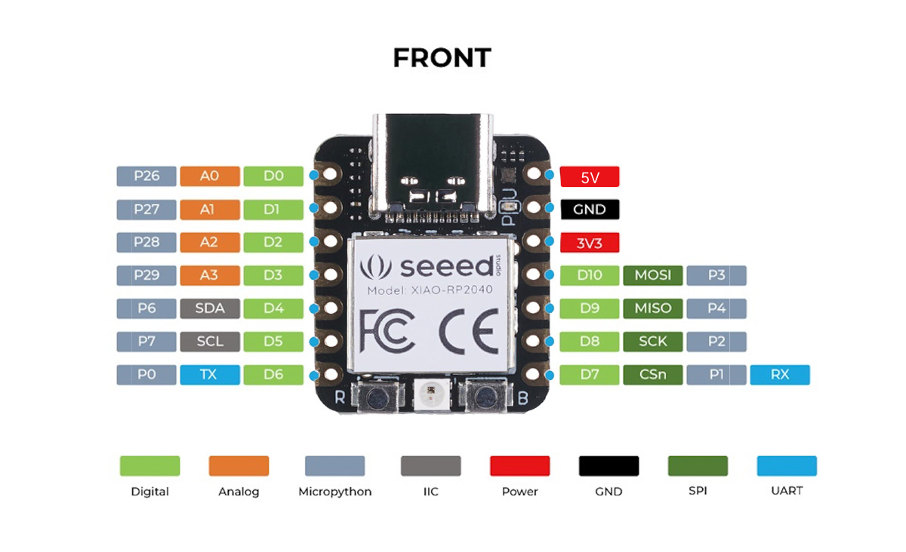

## はじめに

このテキストでは、新歓用の実習として「XIAO RP2040」というマイコンボードを用いたプログラミングの基礎を解説します。  
各レッスンは、「コード例」→「用語の解説」→「プログラムの動作」の順で進みます。最後に演習問題を用意しているので、実際に手を動かして理解を深めていきましょう。

---

## Lesson 01: LEDを点灯させる

### このレッスンの目標
- マイコン（マイクロコントローラ）の概念を知る
- XIAO RP2040の基本構成を知る
- ピン（Pin）、HIGH/LOW の意味を理解する
- `pinMode()` と `digitalWrite()` の役割を理解する
- `setup()` と `loop()` の役割と実行順序を理解する

### 01-1. マイコンおよび XIAO RP2040 とは

マイコン（マイクロコントローラ）とは、電子機器を制御するために必要な機能一式（CPU、メモリ、入出力端子など）を1つのチップに集約した小型のコンピューターです。身の回りの家電から自動車、産業用機器まで、あらゆる製品に組み込まれて動作の制御を担っています。あらかじめ指定されたプログラムに従って、センサーからの入力を処理したり、モーターやLEDなどへ信号を出力したりするのが主な役割です。

XIAO RP2040 は、Seeed Studio社が開発した小型のマイコンボードです（Arduinoプラットフォームでプログラミングが可能です）。

主な特徴：
- PCとUSB接続し、作成したプログラムを書き込むことができる
- 基板の縁にある端子をピン（Pin）と呼び、ここを経由して電圧の入出力を行う
- LEDの点灯やセンサー情報の読み取りなど、外部部品を制御できる

各ピンの役割や接続先については、下図および概要を参照してください。



主に使用するピンとその役割：
- D0〜D10（デジタルピン）： デジタル入出力（HIGH/LOW）によるLEDの点灯、およびスイッチの入力判定などに使用します。
- A0〜A3（アナログピン）： センサーなどから連続的な電圧変化を読み取る場合に使用します。
- 3V3： 3.3Vの電源を出力するためのピンです。
- GND（グラウンド）： 回路の基準となる0Vのピンです。各種電子部品を電気的にマイコンと構成するための電気の戻り道となります。
- 5V： USB接続から供給されている5V電圧を出力するピンです。

.png)

今回の実習で使用する部品の接続先：
- D0 ピン： LED 1
- D1 ピン： LED 2
- D2 ピン： LED 3
- D9 ピン： タクトスイッチ（ボタン）
- GND ピン： 各部品をつなぐ電気の戻り道（0Vの基準点）

### 01-2. ピン「D0」とは

ピンとは、マイコンボードが外部の電子部品（LEDやスイッチなど）と電気的にやり取りするための窓口です。

サンプルコードに出てくる `D0` は、複数あるピンの中の「0番のデジタルピン」を指します（DはDigitalの略です）。

`D0` ピンで想定される役割：
- 電圧を出力する → `digitalWrite()` を用いてLEDを点灯させるなど
- 外部の電圧を読み取る → `digitalRead()` を用いてスイッチの状態を調べるなど

今回のプログラムでは、このD0ピンからLEDに電力を供給して点灯させることを目的とします。

### 01-3. HIGH と LOW の違い

デジタルピンは、基本的に「2つの状態」のいずれかを取ります。これが HIGH と LOW です。

| 状態 | 電圧 | 意味 |
|------|------|----------------|
| HIGH | 約3.3V | 電圧がかかっている状態（オン） |
| LOW | 0V | 電圧がかかっていない状態（オフ） |

回路が成立していれば、HIGHのときにLEDに電流が流れて点灯し、LOWのときに消灯します。

### 01-4. `pinMode()` 関数

関数とは、マイコンに特定の処理を実行させるための命令のまとまりです。

```cpp
pinMode(D0, OUTPUT);
```

この命令は「D0ピンを OUTPUT（出力用）に設定する」という意味です。

| カッコの中身（引数） | 対象 | 例 |
|----------------|----------------|-----|
| 第1引数（左側：`D0`） | どのピンの設定を変えるか | D0, D1, D2 など |
| 第2引数（右側：`OUTPUT`） | そのピンをどのような役割にするか | OUTPUT（出力用） または INPUT（入力用） |

OUTPUT に設定する理由：
LEDを点灯させるためには、マイコン側からLEDに向かって電圧を「出力」する必要があるためです。

### 01-5. `digitalWrite()` 関数

```cpp
digitalWrite(D0, HIGH);
```

こちらは「D0ピンから HIGH の電圧を出力する」という意味の関数です。

| カッコの中身（引数） | 対象 | 例 |
|----------------|----------------|-----|
| 第1引数（左側：`D0`） | どこから信号を出すか | D0, D1 など |
| 第2引数（右側：`HIGH`） | 出力状態 | HIGH（オン）, LOW（オフ） |

プログラム上での動作：
- `digitalWrite(D0, HIGH)` → D0から電圧が出力され、LED が 点灯 します。
- `digitalWrite(D0, LOW)` → D0からの電圧供給が止まり、LED が 消灯 します。

### 01-6. `setup()`と`loop()`という２つの重要ブロック

Arduinoのプログラムには、必ず次の2つの関数（ブロック）が含まれます。

```cpp
void setup() {
    // マイコン起動時に【1回だけ】実行される初期設定の場所
}

void loop() {
    // setup() の後、【何度も繰り返し】実行されるメイン処理の場所
}
```

プログラムが実行される順番：
1. マイコンの電源が入る
2. `setup()` を一通り実行して、ピンの設定（OUTPUT/INPUT等）を行う
3. `loop()` を実行する
4. `loop()` が最後まで到達したら、再び `loop()` の先頭に戻って繰り返し実行する

### 01-7. コード例全体の流れ

```cpp
void setup(){
    pinMode(D0, OUTPUT);  // ① 起動時に1回だけ実行。
                          //    D0 ピンを「出力用」にセットする。
}

void loop(){
    digitalWrite(D0, HIGH);  // ② そのあと継続して繰り返し実行。
                             //    D0 ピンから電圧を出力し続ける。
}
```

この仕組みにより、マイコンに通電している間はLEDが点灯し続けます。

### 01-8. 回路の仕組み

`docs/images/XIAORP2040.jpg` を参考に、回路の構造を確認しておきましょう。

電気の通り道（回路）：
```
[D0 ピン] → [抵抗 (過電流を防ぐため)] → [LEDのアノード(＋側)] → [LEDのカソード(－側)] → [GND (グラウンド: 0V)]
```
この流れで1つのループが形成されることで、電気が流れてLEDが光ります。

### 01-9. 演習問題

ここまでの知識を活用し、D1 ピンに接続された LED（LED 2）を点灯させるプログラムを作成してください。

---

## Lesson 02: `#define` と `delay()` を使う

### このレッスンの目標
- `#define` を使い、ピン番号や数値の別名を定義してコードを読みやすくする
- `delay()` を使ってプログラムを待機させる方法を知る
- LEDを指定間隔で点滅させる

### 02-1. `#define` とは

`#define` は、コンパイル（人が書いたプログラムをマイコン用の言語に翻訳する作業）が始まる直前に、特定の文字列を置き換えてくれる機能です。
変数のように値を保持するのではなく、単なる「文字列の置き換え」として動作します。

```cpp
#define D0 LEDPin1
```

コード内でこのように記述すると、以降のプログラムにおいて `D0` という文字列が使用されている部分は、コンパイル時にすべて自動で `LEDPin1` に置き換えられます。

`#define` を利用することで、たとえば「このD0ピンは何の用途なのか」といった情報に対して「わかりやすい別名」をつけることができます。
意図が明確になるため、後からコードを見返したり、他人が読んだりする際の可読性が大きく向上します。

### 02-2. `delay()` とは

`delay()` は、指定した時間のあいだプログラムの処理を一時停止（待機）させる関数です。
時間はミリ秒（1000ミリ秒 ＝ 1秒）で指定します。

```cpp
delay(1000);
```

このように記述すると「1000ミリ秒（＝1秒）待つ」という意味になります。
待機している間、マイコンは次の処理へ進みません。「LEDを点灯させてから少し待機し、消灯させてまた待機する」という処理をループさせることで、LEDを点滅させることができます。

### 02-3. 全体の動作を確認する

`example_code_2.ino` は、特定のピンを出力用に設定してLEDを点灯させ、1秒間待機するシンプルなプログラムです。

```cpp
#define D0 LEDPin1

void setup(){
    pinMode(LEDPin1, OUTPUT);
}

void loop(){
    digitalWrite(LEDPin1, HIGH);
    delay(1000);
}
```

実行フロー：
1. `#define` により、`D0` を `LEDPin1` と呼称することが定義される
2. `setup()` 内で、`LEDPin1`（つまり D0ピン）を「OUTPUT（出力用）」に設定する
3. `loop()` 内で、`LEDPin1` から HIGH（3.3V）を出力しLEDを点灯させる
4. `delay(1000)` により、その状態で1秒間待機する
5. 1秒経過すると `loop()` の最後まで到達したため、また最初に戻る

ただし、このコードは「LEDを点灯させて1秒経過したら、再度点灯させる（点灯し続ける）」という処理になっているため、見た目上は常時点灯しているだけになります。

### 02-4. 演習問題

ここまでの知識を応用して、D0、D1、D2の3つのピンに接続されたLEDを、1秒ごとに順番に点灯（入れ替え）させるプログラムを作成してください。

条件：
- 3つのピンをすべて `#define` を使って定義する
- 1 秒ごとに点灯する LED を切り替える
- 点灯していない LED は消灯しておく
- D0 → D1 → D2 の順で繰り返す

---

## Lesson 03: `const`・配列・変数の型を使う

### このレッスンの目標
- 複数のピン変数を効率よく扱うための「配列」を習得する
- 変数の「型」の概念を理解する
- `int` や `uint8_t` といった型の用途を整理する

### 03-1. `const` とは

`const`（定数を意味する constant の略）は、「この変数の値は後から変更しない」と宣言するための修飾子です。
プログラムの実行中に誤って値を変更しようとすると、コンパイルエラーとして警告してくれます。
本レッスンでは深入りしませんが、定数を作る際に役立つ記述だと覚えておいてください。

### 03-2. 配列とは

配列は、複数の同種のデータを同じ名前でまとめて管理するためのデータ構造です。
1番目のデータは `[0]`、2番目は `[1]` というように、0から始まる要素番号（インデックス）を使ってデータを取り出します。

```cpp
uint8_t led[3] = {D0, D1, D2};
```

この記述により、「`led` という名前で3つ分のデータ（D0, D1, D2）を格納する配列」を定義しています。
配列化することで、後述する `for` 文を用いた繰り返し処理に対して組み込みやすくなり、コードの冗長さを減らすことができます。

### 03-3. 変数の「型」とは

プログラミングにおける変数には、その変数が「どのような性質のデータを格納するか」を定めた 型 が存在します。
「小規模な整数用」「負の数も扱える整数用」など、様々な型があります。

今回のコードでは `uint8_t` という型を使用しています。

```cpp
uint8_t led[3] = {D0, D1, D2};
```

`uint8_t` の構成要素を確認すると、次のようになります：
- `u` = unsigned（符号なし、つまり負数を含まない）
- `int` = 整数型
- `8` = 8ビット（容量が小さい）
- `t` = type（型）

すなわち、`uint8_t` は 0 から 255 までの正の整数のみを格納する型 です。

`uint8_t` を選択する理由：
- ピンの番号やLEDの個数は「0〜255」の範囲に収まる正の数であるため
- 必要以上のメモリ（データ容量）を消費せず、適切なサイズで定義できるため
- 「この変数には負の値は入らない」という制約を明示化できるため

### 03-4. `int` と `uint8_t` の使い分け

マイコンのプログラミングで最も一般的に用いられる整数型が `int`（イント）です。  
計算やループのカウンタ（回数カウント）など、広範な用途において使用され、万能なように思えます。

ただし、今回のコードでは `int` ではなく、あえて `uint8_t` という型を使用しています。

| 型 | 入れられる数値の範囲 | 適した用途 |
|---|---|---|
| `int` | 環境により異なりますが、多くは −3万〜＋3万 程度の範囲 | 計算や、負の値が含まれる可能性のある一般的な整数処理 |
| `uint8_t` | 0〜255 | 0以上の小さい整数（ピン番号変数、カウンタ変数、色の階調など） |

この使い分けの意図：
`int` を使用しても同様に動作しますが、プログラミングにおいては「この変数は絶対に負にならないし、255以上の大きな数も扱わない」と明示する目的で、特定の制約を持たせた型（ここでは `uint8_t`）を選択することがあります。コードの可読性や安全性を高める工夫の1つです。

### 03-5. `for` 文による繰り返し処理

コードの以下の部分に注目してください：  
`for (uint8_t i = 0; i < 3; i++)`

これが `for` 文と呼ばれる「指定した回数だけ繰り返す」構文です。  
ここでも `i` というカウンタ（周回数を記録する変数）の定義として、`uint8_t` を用いています。これは、「変数 i を 0 から開始し、3 未満のあいだ（つまり 0、1、2）、1 ずつインクリメント（増加）させながら内部の処理を繰り返す」という表現を意味します。

### 03-6. const 修飾子について

コードの冒頭では、配列の宣言に `const` という修飾子がついています。

```cpp
const uint8_t led[3] = {D0, D1, D2};
```

`const`（コンスト＝constant の略）をつけると、その変数は「定数」になり、後からプログラム内で中身を上書き変更することができなくなります。
ピン番号など「実行中に絶対に変わってはいけない値」に `const` を付けておくことで、間違えて別の数値で上書きしてしまうバグを未然に防ぐことができます。これもプログラミングにおける安全性を高める工夫です。

### 03-7. 全体の動作を確認する

```cpp
const uint8_t led[3] = {D0, D1, D2};

void setup() {
    // インデックス 0 から 2 まで同じ処理を繰り返し、配列内のピン全てを「出力」に設定する
    for(uint8_t i = 0; i < 3; i++) {
        pinMode(led[i], OUTPUT);
    }
}

void loop() {
    // 0番目のLEDを点灯させ、1秒待機した後に消灯する
    digitalWrite(led[0], HIGH);
    delay(1000);
    digitalWrite(led[0], LOW);
    
    // 1番目のLEDを点灯させ、1秒待機した後に消灯する
    digitalWrite(led[1], HIGH);
    delay(1000);
    digitalWrite(led[1], LOW);
    
    // 2番目のLEDを点灯させ、1秒待機した後に消灯する
    digitalWrite(led[2], HIGH);
    delay(1000);
    digitalWrite(led[2], LOW);
}
```

実行フロー：
1. `led` という名前の配列に、定数として `D0`, `D1`, `D2` のピン情報を格納する
2. `setup()` の中で `for` ループを使用し、`led[0]`〜`led[2]` のピンすべてを「OUTPUT（出力用）」に設定する
3. `loop()` の中で、0 番目のLEDを `HIGH`(点灯)にし、1秒待って `LOW`(消灯)にする
4. 続いて 1 番目のLEDに対し同じ処理（点灯→1秒待機→消灯）を行う
5. 最後に 2 番目のLEDに対し同じ処理を行う
6. `loop()` は終了後に再び先頭から繰り返すため、結果として「LEDがひとつずつ順番に光ながら移動する」アニメーションになります。

### 03-8. 演習問題

`for` 文を活用し、D0、D1、D2 のピンに接続されたLEDを順に点灯させる処理を記述してください。

条件：
- `loop()` 内で、必ず `for` 文を用いること
- D0 → D1 → D2 の順で巡回させる

---

## Lesson 04: `digitalRead()` による入力の読み取り

### このレッスンの目標
- `digitalRead()` の用途と利用方法を理解する
- スイッチの入力状態とLEDの出力を連携させる
- 入力ピンにおける「プルアップ抵抗」の役割を理解する

### 04-1. `digitalRead()` とは

これまで使用してきた `digitalWrite`（電圧を出力する）とは逆で、`digitalRead()` は外部からの電圧の状態を「読み取る」関数です。  
この関数を使用することで、マイコンは指定されたピンの現在の状態（HIGH または LOW）を取得できます。

### 04-2. プルアップ抵抗の重要性

入力用のピン（スイッチなど）を扱う際に問題となるのが、「スイッチが押されておらず、かつ外部のどこにも接続されていない宙ぶらりんの状態（オープン状態）」です。
マイコンの入力ピンは高感度に設計されているため、オープン状態だと周囲のノイズを拾い、「HIGH か LOW か」が不定になってしまう（バタつく）現象が発生します。

これを防止するための回路的な工夫が プルアップ です。
ピンが不定にならないよう、「スイッチが押されていないときは、内部または外部の抵抗器を通してあらかじめ電圧を HIGH の状態に引き上げておく」という設計手法です。

これにより、入力状態が安定して監視できます。
- スイッチを押していない時 → あらかじめ HIGH 状態が維持されているため検出結果は「HIGH」
- スイッチを押した時 → 経路がGND（0V）に短絡するため、検出結果は「LOW」に変化する

今回の演習コードでも、この仕組みを利用してボタンの押下判定を行っています。

### 04-3. 全体の動作を確認する

```cpp
#define D9 button
uint8_t led[3] = {D0, D1, D2};

void setup() {
    for(uint8_t i = 0; i < 3; i++) {
        pinMode(led[i], OUTPUT);
    }
    pinMode(button, INPUT);  // D9 を「入力用」に設定
}

void loop() {
    // もしボタンピンの読み取り状態が「LOW（押下されている）」であれば
    if(digitalRead(button) == LOW){
        for(uint8_t i = 0; i < 3; i++) {
            digitalWrite(led[i], HIGH);
            delay(500); // 0.5秒おきに点灯
        }
    } else {
        // ボタンが押下されていない時は、すべてのLEDを消灯する
        for(uint8_t i = 0; i < 3; i++) {
            digitalWrite(led[i], LOW);
        }
    }
}
```

実行フロー：
1. `#define` により `D9` ピンを `button` として定義する
2. LED出力用ピンは配列変数 `led` に格納する
3. `setup()` の中で LED を出力（OUTPUT）、ボタンピンを入力（INPUT）に設定する
4. `loop()` の分岐（`if` 文）内において、`digitalRead()` でボタンの状態を読み取る
5. 「条件が LOW（ボタンが押されている）」と判定できた場合は、3つのLEDを0.5秒間隔で順に点灯させる
6. 「条件がそれ以外（ボタンが押されていない）」と判定された場合は、3つのLEDをすべて消灯させる

### 04-4. グローバル変数とローカル変数の違い

演習問題に取り組む前に、変数のスコープ（有効範囲）について確認しておきます。プログラム内で変数を宣言する場所によって、データの保持期間とアクセスできる範囲が異なります。

グローバル変数：
`setup()` や `loop()` といった関数の「外側」（通常はプログラムの上部）で宣言する変数です。プログラム全体のどこからでも参照や変更が可能であり、マイコンが稼働している間は常に値を保持し続けます。
「これまでにボタンが押された回数」など、繰り返し実行される `loop()` の周期をまたいで記憶し続けたい値の保存に適しています。

```cpp
// ==== グローバル変数の例 ====
uint8_t count = 0; // すべての関数の外で宣言する

void setup() {
    count = 1; // どこからでも上書き・読み出しが可能
}

void loop() {
    count++; // loop関数が繰り返されるたびに、値が上書き保存されて増え続ける（記憶される）
}
```

ローカル変数：
関数や `for` 文などのブロックの「内側（ `{` と `}` の間 ）」で宣言する変数です。宣言されたブロックの中だけで有効であり、処理がそのブロックを抜けると同時に変数は破棄（リセット）されます。

```cpp
// ==== ローカル変数の例 ====
void loop() {
    uint8_t num = 0; // loop関数の中で宣言（ローカル変数）
    num++; // 1増やすが、loop関数が最後まで行くと変数は消滅する

    // 毎回 loop の最初に新しく 0 として作られるため、いつまで経っても 1 にしかならない
    
    for (uint8_t i = 0; i < 3; i++) {
        // 変数 i はこの for 文の { } の中でしか使えない
    }
    // ここで変数 i を使おうとすると「宣言されていません」というエラーになる
}
```

これらを踏まえ、次の演習問題では「押下回数」を安全に記憶し続けるために、どちらの変数が必要かを意識して論理を組み立ててください。

### 04-5. while文（条件付きループ）の使い方

これまでに学んだ `for` 文は「決まった回数」の繰り返しに使いました。一方で `while`文 は「条件が満たされている間、ずっと繰り返す」ための構文です。

```cpp
while (条件式) {
  // 条件が真（正しい）である限り、この中の処理を延々と繰り返す
}
```

例えば、「ボタンが押されている（`LOW`である）間、ずっと待機し続けたい」場合は以下のように記述します。

```cpp
while (digitalRead(button) == LOW) {
  delay(10); // 10ミリ秒だけ待つ（これを繰り返す）
}
```

マイコンは上から順にプログラムを実行しますが、`while` にたどり着くと、`digitalRead(button) == LOW` という条件が成立している（＝ボタンが押されたままの）間は、ブロックの中身（`delay(10)`）を繰り返し続けます。
そして指が離されて状態が `HIGH` に変わると、条件から外れるため `while` のループから抜け出し、次の行へと進みます。

これを利用することで、「ボタンの長押し」を意図的に待機させて、処理が何度も実行されてしまうのを防ぐことができます。

### 04-6. 演習問題

「ボタンが 5回 押されたら、D0 の LED が（継続して）点灯する」というプログラムを実装してください。

ヒント：
- `loop()` より上部に、ボタンが押された回数を数えるグローバル変数を定義して初期値を設定します（例: `uint8_t count = 0;`）。
- `loop()` の内部で `digitalRead(button)` を使い、ボタンが `LOW`（押されている）かどうかを判定します。
- ただし `LOW` かどうかのみで分岐させて単純にカウントを増やすと、マイコンの処理が速すぎて「1回ボタンを押して離すまでの間」に何度もカウントされてしまいます。
- これを防ぐため、カウントを増やした直後に「指が離されるまで何もせず待つ」という工夫をします。
  - `while`文を使って `while (digitalRead(button) == LOW) { delay(10); }` と書くことで、ボタンが押されている間はずっとブロック内で待機させることができます。
- カウンタの変数が 5 に達した場合は `digitalWrite(D0, HIGH)` で LED を点灯させます。

想定される思考手順：
1. `digitalRead()` でボタンが押されたか確認する
2. 押されていたら、カウントを「＋１」する
3. `while` 文を使って、指が離れる（HIGHに戻る）まで待機する
4. カウントが目標の5回に到達したら、対象のLEDに電圧を出力して点灯させる


---

## Lesson 05: シリアル通信（Serial）でPCとやり取りする

### このレッスンの目標
- シリアル通信とパラレル通信の違いを理解する
- UART通信の特徴を知る（I2CやSPIなどの存在を知る）
- `Serial.begin()`, `Serial.print()`, `Serial.println()` の使い方を習得する
- マイコンからPCへ文字や変数の数値を送信して動作を確認する

### 05-1. シリアル通信とパラレル通信の違い

マイコンと他の機器（今回はPC）でデータをやり取りする方法には、大きく分けて「パラレル通信」と「シリアル通信」の2種類があります。

- パラレル通信： 複数の信号線を使い、一度にたくさんのデータを並行してドサッと送る方式。速度は出しやすいが、線が多くなり配線が複雑になります。
- シリアル通信： 1〜2本の少ない信号線を使い、データを1列に並べて順番にチビチビと送る方式。配線がシンプルで長距離でもエラーが起きにくいのが特徴です。

現代の電子機器は高速化技術が進歩したため、USB（Universal Serial Busの略）に代表されるようにシリアル通信が主流となっています。

### 05-2. USBケーブルの中身と UART とは

PCとXIAO RP2040は太いUSBケーブルで繋がれているため「何本もの線でパラレル通信しているのでは？」と直感的に思うかもしれません。しかし、実際にデータ通信の主役となっているのは「送信（TX）」と「受信（RX）」の2本の線（シリアル通信）です。

今回Arduinoで主に使用している通信方式は UART（ユーアート） と呼ばれます。
UARTは、TX（送信）とRX（受信）の2本の線をクロスさせて繋ぎ、1対1でシンプルにデータを送り合う古くからある強力な通信規格です。

なお、「シリアル通信」という言葉は総称です。UARTの他にも、用途に応じて以下のような様々なシリアル通信の手法が存在することを頭の片隅に置いておきましょう。
- I2C（アイ・スクエア・シー）： 2本の線で複数のセンサーと通信するのが得意
- SPI（エス・ピー・アイ）： 3〜4本の線を使い、I2Cよりも高速に通信するのが得意

### 05-3. Serial 関数について

Arduinoでは、UART通信を使ってPCとやり取りするために Serial という関数群が用意されています。デバッグ（プログラムが正しく動いているかの確認）において非常に重宝します。

`Serial.begin(9600);`
- 意味：PCとの通信速度（ボーレート）を 9600 bps に設定して、通信を開始します。
- 配置：起動時に1回だけ実行すればよいので `setup()` の中に書きます。この速度がPC側の設定と一致していないと、文字化けしてしまいます。

`Serial.print("文字列");` / `Serial.println("文字列");`
- 意味：カッコの中の文字や変数の数値をPCに向けて送信します。
- print は改行なし、println は送信後に改行（Line New）が入ります。

### 05-4. 全体の動作を確認する

example_code_5.ino では、前回の演習をもとに「ボタンを押した回数」をPCに送信するプログラムを作成しました。

```cpp
#define button D9

// 必要なグローバル変数は「カウント」だけ
uint8_t count = 0;

void setup() {
    Serial.begin(9600);      // PCとの通信を9600bpsで開始
    pinMode(D0, OUTPUT);
    pinMode(button, INPUT);
}

void loop() {
  // ボタンが押されているかをチェック
  if (digitalRead(button) == LOW) {
    count++; // カウントを1増やす
    
    // 指が離されるまで待機する（連打・長押し判定を防ぐ）
    while (digitalRead(button) == LOW) {
        delay(10);
    }
    // 現在のカウント数をPCへ送信（文字と変数を組み合わせる）
    Serial.print("ボタンが");
    Serial.print(count);
    Serial.println("回押されました");
  }
  
}
```

実行フロー：
1. setup() の先頭で `Serial.begin(9600)` を実行し、PCへの送信準備を整える
2. loop() の中で毎周期ボタンの監視を行う
3. ボタンが押されたら `count` を1増やし、指が離れるまで `while` で待機する
4. `Serial.print("ボタンが");` で改行せずに文字を送信
5. `Serial.print(count);` で現在の `count` の数値を送信
6. `Serial.println("回押されました");` で文字を送信し、最後に改行する
7. Arduino IDEの設定画面（シリアルモニタ）を開いて通信速度を 9600 に合わせると、「ボタンが3回押されました」のように送信結果が文字として表示される

`Serial.print()`と`Serial.println()`の違いを理解するために`Serial.println("回押されました");`を`Serial.print("回押されました");`に変更したり、`Serial.print(count);`を`Serial.println(count);`に変えたりしてみましょう。

### 05-5. 演習問題

ボタンが押された回数とそれが偶数か奇数かを表示し、偶数回のときは次にボタンが押されるまでLEDが点灯するプログラムを実装してください

条件：
- 偶数回のとき"ボタンがn回押されてました" "偶数回です"と表示されるようにしてください。奇数回のときも同様です。
- "ボタンがn回押されてました"と"偶数回です"の間は改行されるようにしてください。奇数回のときも同様です。
- 偶数回にはD0を点灯させてください

---

## Lesson 06: 超音波センサで距離を測る

### このレッスンの目標
- 超音波センサの仕組みと3つの出力形式（PWM・アナログ・UART）を理解する
- PWM信号・アナログ信号の特徴を知る
- `pulseIn()` でパルス幅を計測する方法を知る
- `analogRead()` でアナログ値を取得する方法を知る
- 計測値を距離に換算し、`Serial.print()` でPCに表示する

### 06-1. 超音波センサの出力について

超音波センサは、超音波を発信し、物体からの反射を検出することで距離を測定します。今回使用する超音波センサは次の3種類の出力に対応しています。

- **PWM出力**：パルス幅（HIGHの時間）で距離を表現。パルス幅が長いほど遠いことを示します。
- **アナログ出力**：電圧値で距離を表現。距離に応じて0V～3.3Vなどの範囲で変化します。
- **UART出力**：シリアル通信（TX/RX）でデジタル値として距離データを送信します。PCや他のマイコンと直接データ通信が可能です。


#### 【用語解説】PWM信号・アナログ信号とは？
- **PWM（Pulse Width Modulation）信号**：デジタル信号のON/OFF（HIGH/LOW）の時間幅を変化させることで情報を伝える方式。超音波センサでは、1回のパルスのHIGH時間が距離に比例します。
- **アナログ信号**：連続的に変化する電圧値で情報を伝える方式。センサの出力電圧が距離に比例します。

### 06-2. `pulseIn()` と `analogRead()` の使い方

- `pulseIn(pin, HIGH)` は、指定したピンがHIGHになっている時間（マイクロ秒単位）を返します。超音波センサのPWM出力ピンに使うことで、パルス幅から距離を計算できます。
- `analogRead(pin)` は、指定したアナログピンの電圧値を0～4095（12bit ADCの場合）などの数値で返します。アナログ出力ピンに使うことで、電圧値から距離を計算できます。

#### 【関数解説】
- `pulseIn()`：第1引数にピン番号、第2引数にHIGHまたはLOWを指定。ピンが指定した状態になっている時間（μs）を返す。
- `analogRead()`：第1引数にアナログピン番号を指定。ピンの電圧をADC（A/Dコンバータ）でデジタル値に変換して返す。

### 06-3. マイコンのピンによる電圧の読み取りと計算方法

マイコンのアナログピン（A0など）は、外部から入力された電圧を「A/Dコンバータ（ADC）」という回路でデジタル値（数値）に変換して読み取ります。
- 今回使用しているマイコンRP2040はADCが12ビットなので`analogRead()` の戻り値は `0` ～ `4095` の範囲の数値になります。
- この数値のうち、 `0` は `0V` に、 `4095` はマイコンの基準電圧（RP2040の場合は `3.3V`）にそれぞれ対応しています。

**実際の電圧値（V）への計算式**
読み取った数値から実際の電圧を求めるには、次の計算式を使います：
```
電圧(V) = analogReadの値 × 基準電圧 / (ADCの最大値)
```
例：基準電圧が `3.3V`、ADCの最大値が `4095` の場合
```
電圧(V) = analogReadの値 × 3.3 / 4095
```
このようにして、`analogRead()` で得られた数値に特定の計算をすることで、ピンにかかっている実際の電圧（V）を求めることができます。

### 06-4. サンプルコード（未完成）

`example_code_6.ino` の最新版は以下の通りです。

```cpp
#define D3 analog_Pin
#define D9 PWM_Pin

void setup(){
    pinMode(analogPin,INPUT);
    pinMode(PWMPin,INPUT);
}

void loop(){
    long PWM_duration = pulseIn(PWM_Pin,HIGH);
    int analogValue = analogRead(analog_Pin);
    // ...計算・表示処理は未記入...
}
```

このコードは、
- PWM出力のパルス幅取得（`pulseIn`）
- アナログ出力の値取得（`analogRead`）
までが記述されています。距離換算やシリアル出力処理は未記入です。

### 06-5. 実行フロー（完成イメージ）
1. `setup()` でシリアル通信とピン設定
2. `loop()` でPWMパルス幅・アナログ値を取得
3. データシートの換算式で距離に変換
4. シリアルモニタに結果を表示
5. 一定間隔で繰り返し

### 06-6. 演習問題

超音波センサのデータシート 2ページ目 を参照し、`example_code_6.ino` のサンプルコードを完成させてください。

課題：
- PWM出力から得た値を、データシート2ページ目の仕様に基づいて距離へ換算する
- アナログ出力から得た値を、データシート2ページ目の仕様に基づいて距離へ換算する
- 換算した結果をPCのシリアルモニタへ表示する

条件：
- `Serial.begin(9600);` で通信初期化
- PWM・アナログ両方の距離を表示
- 表示は繰り返し更新されること

---

## Lesson 07: シリアル通信（UART）によるデータ受信と文字コード

### このレッスンの目標
- 受信バッファの概念を理解する
- `Serial.available()` と `Serial.read()` の役割を理解する
- データシートからUART通信のデータフォーマットを読み解く
- ASCIIコードによる文字データから数値データへの変換手法を理解する

### 07-1. シリアル通信の受信と「バッファ」の概念

シリアル通信において、機器からマイコンへ送信されたデータは即座にプログラムの変数に代入されるわけではありません。マイコンの内部には「受信バッファ」と呼ばれる一時的な記憶領域（メモリ上の待合室）が存在します。通信によって到着したデータは、1バイト（8ビット）ずつこのバッファに順番に蓄積されます。

これらを処理するために、以下の2つの関数を使用します。

- `Serial.available()`：現在、受信バッファに何バイトの未処理データが溜まっているか（読み取り可能か）を数値で返す関数です。データが存在しない場合は `0` を返します。
- `Serial.read()`：受信バッファの先頭からデータを1バイトだけ読み取り、同時にバッファからそのデータを削除する関数です。

データを受信する際は、まず `available()` でバッファにデータが到着しているかを確認し、存在する場合のみ `read()` でデータを取り出す、という手順を踏むのが原則です。

### 07-2. 超音波センサのデータ出力フォーマット

センサからどのような順番・形式でデータが送られてくるのかは、対象部品のデータシートを確認する必要があります。
今回の超音波センサ（LV-MaxSonar-EZシリーズ）のシリアル通信（Pin 5 TX）の仕様は以下の通りです。

- 非同期シリアルデータ（RS232フォーマット、0-Vccレベル）で、通信速度は9600 Baudです。
- データの形式は、ASCIIの大文字「R」から始まります。
- 続いて、インチ単位の距離を示す3桁のASCII文字の数字（最大255）が出力されます。
- 最後に、キャリッジリターン（ASCII 13）が出力されます。

これらは5バイトのパケット（データのまとまり）として連続して送信されます。具体例として、計測距離が125インチの場合、センサからは `R`, `1`, `2`, `5`, `\r`（キャリッジリターン）という順番でデータが送られてきます。 また、計測距離が8インチの場合は `R`, `0`, `0`, `8`, `\r` となり、常に3桁が維持される仕様となっています。

### 【補足】 ASCII（アスキー）コードとは？

コンピュータは内部的に「0」と「1」の数値（バイナリデータ）しか処理できません。そのため、人間が使う「文字」をコンピュータに扱わせるには、「どの数値がどの文字に対応するか」という世界共通の変換ルールが必要になります。この絶対的な対応表の代表例が **ASCII（アスキー）コード** です。

ASCIIコードは、0から127までの128個の整数値に対して、アルファベット、数字、記号、そして画面には表示されない「制御文字」をそれぞれ割り当てています。

**主要なASCIIコードの対応表（抜粋）：**

| 文字 | 10進数の値 | 分類・意味 |
| :---: | :---: | :--- |
| `\r` (CR) | 13 | 制御文字（キャリッジリターン：カーソルを行の先頭に戻す） |
| `' '` (Space)| 32 | 空白（スペース） |
| `'0'` | 48 | 数字のゼロ |
| `'1'` | 49 | 数字のイチ |
| `'9'` | 57 | 数字のキュウ |
| `'A'` | 65 | アルファベット大文字 |
| `'R'` | 82 | アルファベット大文字（※今回のセンサの開始文字） |
| `'a'` | 97 | アルファベット小文字 |

#### 文字の正体は「単なる整数値」
Arduino（C++言語）において、シングルクォーテーションで囲まれた1文字（例：`'1'` や `'R'`）は、内部的には「対応するASCIIコードの整数値」として扱われます。

- プログラムに `if (SonicData[0] == 'R')` と書いた場合、マイコン内部では `if (SonicData[0] == 82)` という数値の比較計算が実行されています。
- `Serial.read()` が文字の `'5'` を読み取ったとき、変数に格納されるのは `5` ではなく `53` です。

#### 数字の文字を、計算用の数値に変換する仕組み
ASCIIコード表を見ると、数字の `'0'` から `'9'` までは、**48から57まで連続した整数値**が規則的に割り当てられていることがわかります。この規則性を利用したのが、以下の計算式です。
```cpp
int inches = SonicData[1] - '0';
```
もし SonicData[1] に文字の '5'（ASCIIコードで53）が入っていた場合、プログラム上の '0' はコンパイラによって 48 として評価されるため、実際の計算は以下のようになります。

53 - 48 = 5

このように、基準となる '0' の文字コード（48）を引くことで、文字コードのオフセット（下駄ばき）が相殺され、純粋な計算用の数値である 5 を導き出すことができます。

### 07-3. サンプルコードの動作と数値への変換

以下のサンプルコードは、上記5バイトのパケットから「百の位」の数値を抽出する処理を実装しています。

```cpp
void setup(){
    Serial.begin(9600);
    Serial1.begin(9600);
}

void loop(){

    int SonicData[5] = {0,0,0,0,0};

    if(Serial1.available()){
        SonicData[0] = Serial1.read();
        if(SonicData[0] == 'R'){

            while(!Serial1.available());

            SonicData[1] = Serial1.read();
        }
        while(!Serial1.available());
        SonicData[2] = Serial1.read();
        while(!Serial1.available());
        SonicData[3] = Serial1.read();
        while(!Serail1.available());
        SonicData[4] = Serial1.read();

    }

    int inches = SonicData[1] - '0';

    Serial.println(inches);

}
```

**コードの論理構造：**
データシートの仕様から、正しいデータ群の先頭は必ず `'R'` であることが保証されています。そのため、`SonicData[0] == 'R'` という条件式でパケットの開始を検知しています。検知した後は `while(!Serial1.available());` という空のループ処理によって「次の1バイトがバッファに到着するまで待機」し、到着しだい `read()` で配列の該当箇所に格納する処理を繰り返しています。

**なぜ `SonicData[1] - '0'` で数値が得られるのか：**
`Serial.read()` が返す値は、対象となる数値そのものではなく、ASCII（アスキー）コード規格に基づく「文字コード（10進数の整数値）」です。
ASCIIコードにおいて、数字の文字（'0'〜'9'）には、以下のように連続した整数値が割り当てられています。
- 文字 `'0'` = 10進数の `48`
- 文字 `'1'` = 10進数の `49`
- 文字 `'2'` = 10進数の `50`
...
- 文字 `'9'` = 10進数の `57`

C++言語の仕様として、シングルクォーテーションで囲まれた文字（例: `'0'`）を算術演算に用いると、コンパイラはそれを対応するASCIIコードの整数値（この場合は48）として評価します。
したがって、受信した文字コードから `'0'`（48）を減算する操作は、文字コードのオフセット（48）を相殺する数学的処理を意味します。
例えば、受信した文字が `'5'`（ASCIIコード53）であった場合、内部的には `53 - 48` という演算が行われ、結果として純粋な整数値の `5` が得られます。 この論理により、任意の1桁の数字文字から、計算処理に利用可能な整数値を抽出することが可能です。

### 07-4. 演習問題

上記のサンプルコード `example_code_7.ino` を完成させ、センサから取得した3桁の文字データを結合して、正確な距離（インチ）を算出するプログラムを作成してください。

課題：
- for文を使ってバッファからデータを読みだしてください。
- 取得した百の位、十の位、一の位の文字（`SonicData[1]` 〜 `SonicData[3]`）をすべて整数値に変換してください。
- 変換した数値にそれぞれの桁の重み（×100、×10、×1）を乗算して合算し、1つの変数 `inches` に正しい距離を代入してください。
- 合算された結果をcm単位に変換したうえでPCのシリアルモニタに出力して確認してください。