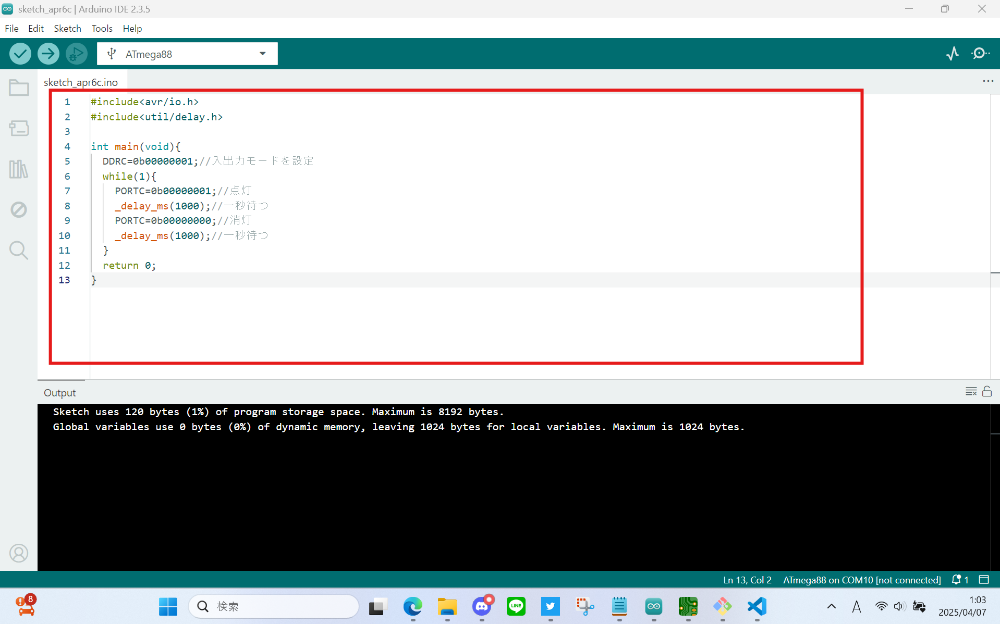
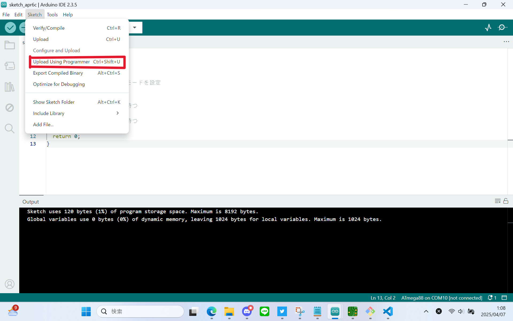
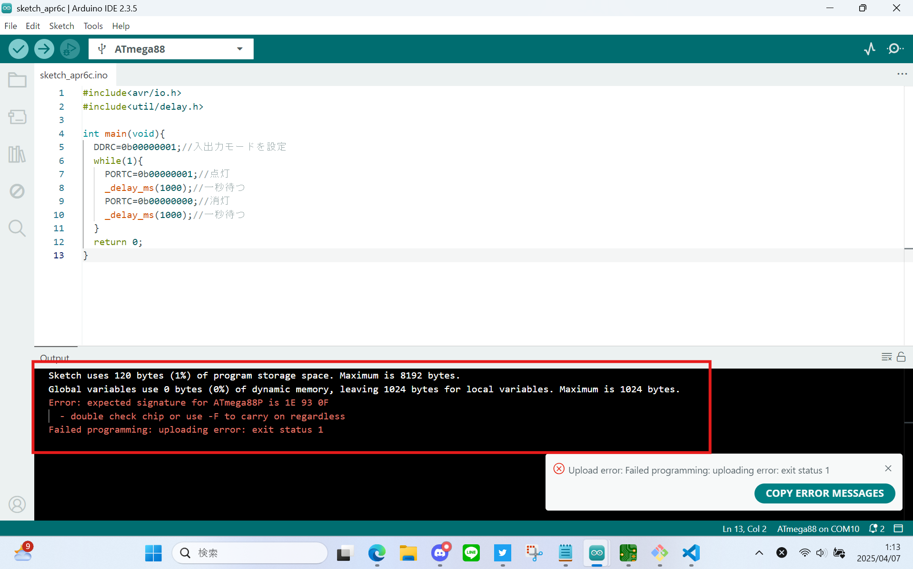
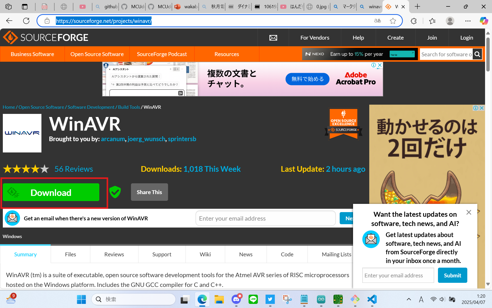
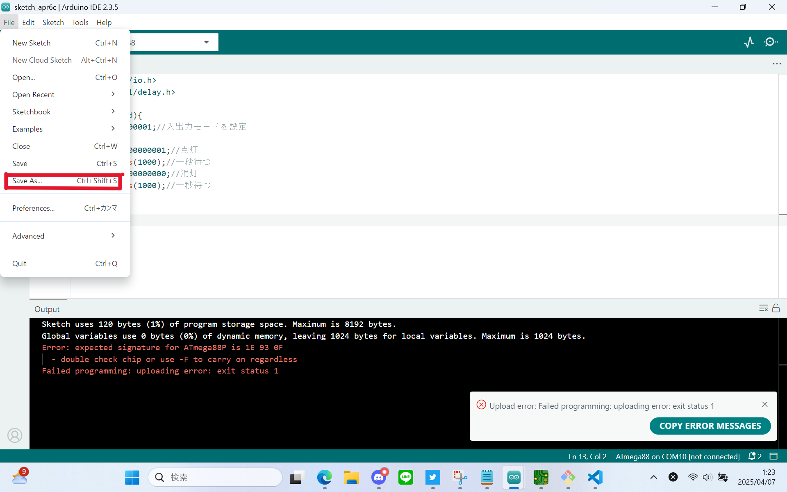
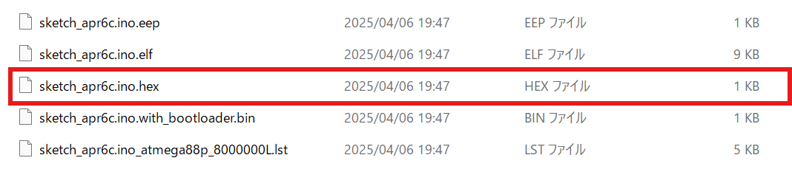

[前回](https://github.com/TitechMeister/2026shinkan/blob/main/docsnew/day0.5/day0.5.md)の続きです。今回はLEDをチカチカさせます。

---

# 目次

* [はじめに(ハードウェア編)](https://github.com/TitechMeister/2026shinkan/blob/main/docsnew/day0/day0.md)
* [はじめに(ソフトウェア編)](https://github.com/TitechMeister/2026shinkan/blob/main/docsnew/day0.5/day0.5.md)
* [第1回 Lチカ](https://github.com/TitechMeister/2026shinkan/blob/main/docsnew/day1/day1.md)
* [第2回 7セグメントLED](https://github.com/TitechMeister/2026shinkan/blob/main/docsnew/day2/day2.md)
* [第3回 ダイナミック点灯](https://github.com/TitechMeister/2026shinkan/blob/main/docsnew/day3/day3.md)


---

## 今回の目標
## プログラムをマイコンに書き込んでLチカをする！！！

---

## 6. プログラミング言語について

今回はC言語を使って開発します。

C言語の勉強のおすすめサイト↓
[苦しんで覚えるC言語](https://9cguide.appspot.com/)

---
## 7.プログラム

### 7.1 プログラムを書く
とりあえず、プログラムを書いてみましょう。今回のは以下のようになります。

```cpp
#include<avr/io.h>
#include<util/delay.h>

int main(void){
	DDRC=0b00000001;//入出力モードを設定
	while(1){
		PORTC=0b00000001;//点灯
		_delay_ms(1000);//一秒待つ
		PORTC=0b00000000;//消灯
		_delay_ms(1000);//一秒待つ
	}
	return 0;
}
```
### 【補足】無限ループ
```cpp
while(1){
	プログラム
}
```
このように書いたプログラムは無限にループ＆実行され続ける

### 7.2プログラムをマイコンに書き込む

step1.[前回](https://github.com/TitechMeister/Device-ATmega88_Board/tree/main/docs/day0/)の通りにArduinoIDEを設定する

step2.赤枠部分にプログラムをコピペ
</img>

step3.赤枠の部分をプッシュ！

</img>

プログラムの書き込みが終わりました。
これでLED点滅（Lチカ）ができたはずです！！！

---

##　もしもエラーがでたら？
</img>

今回使っているatmega88Vというマイコンは少し特殊で上の写真のようなエラーが出るかもしれません。
~~倉庫に余っていたマイコンを適当に選んだせいです。ごめんなさい~~

その時は、ArduinoIDEとは別の方法でマイコンに書き込みをしましょう！

###　書き込み方法

step1.[Winavr](https://sourceforge.net/projects/winavr/)をダウンロード
</img>
step2.ArduinoIDEで.hexファイルを作る

①プログラムを保存する。
</img>

②.hexファイルを作る
</img>

③.hexファイルができる
</img>

step3.コマンドプロンプトからwinavrを起動＆.hexファイルをマイコンに書き込む

.hexのアドレスをコピペして以下の呪文を完成させよう！
```
avrdude -c usbtiny -p m88 -U flash:w:{.hexのアドレスに変える}

```
以下の呪文をコマンドプロンプトに打ち込もう！

以上でマイコンに書き込めたはずです。


---
[次回:DAY2_7セグLED](https://github.com/TitechMeister/2026shinkan/blob/main/docsnew/day2/day2.md)